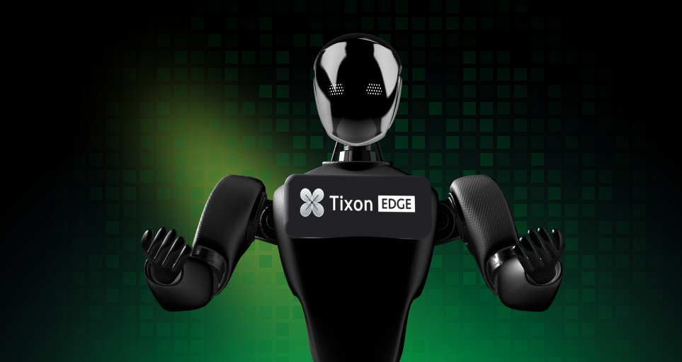

# Introduction

**Project Overview**

TixonEdge is an innovative decentralized Internet of Things (IoT) sensing and computing network that enables users to participate by contributing physical resources, such as computational power, storage, and sensor data, through low-cost hardware devices (e.g., smart sensors, old smartphones, edge computing boxes). The project leverages blockchain protocols to implement resource scheduling, data ownership verification, and token-based incentives, creating a self-operating, cost-efficient, and scalable global IoT network.

<figure><figcaption></figcaption></figure>

**Core Concepts**

TixonEdge's architecture consists of three main layers:

* **LightNode**: A lightweight node that only requires running a small (<100MB) client, making it easy for devices such as old smartphones or IoT sensors to join the network without complex configurations.
* **DePIN Layer**: Integrates distributed physical devices into a dynamic resource pool, enhancing the overall network's efficiency (e.g., environmental sensors, edge computing clusters).
* **Blockchain Layer**: Manages the resource scheduling, records device contributions, allocates token rewards, and automates resource trading and task execution via smart contracts.
